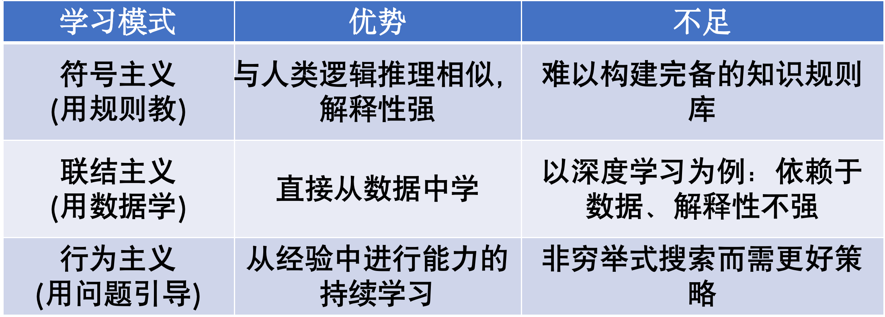
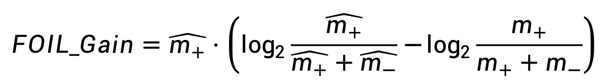
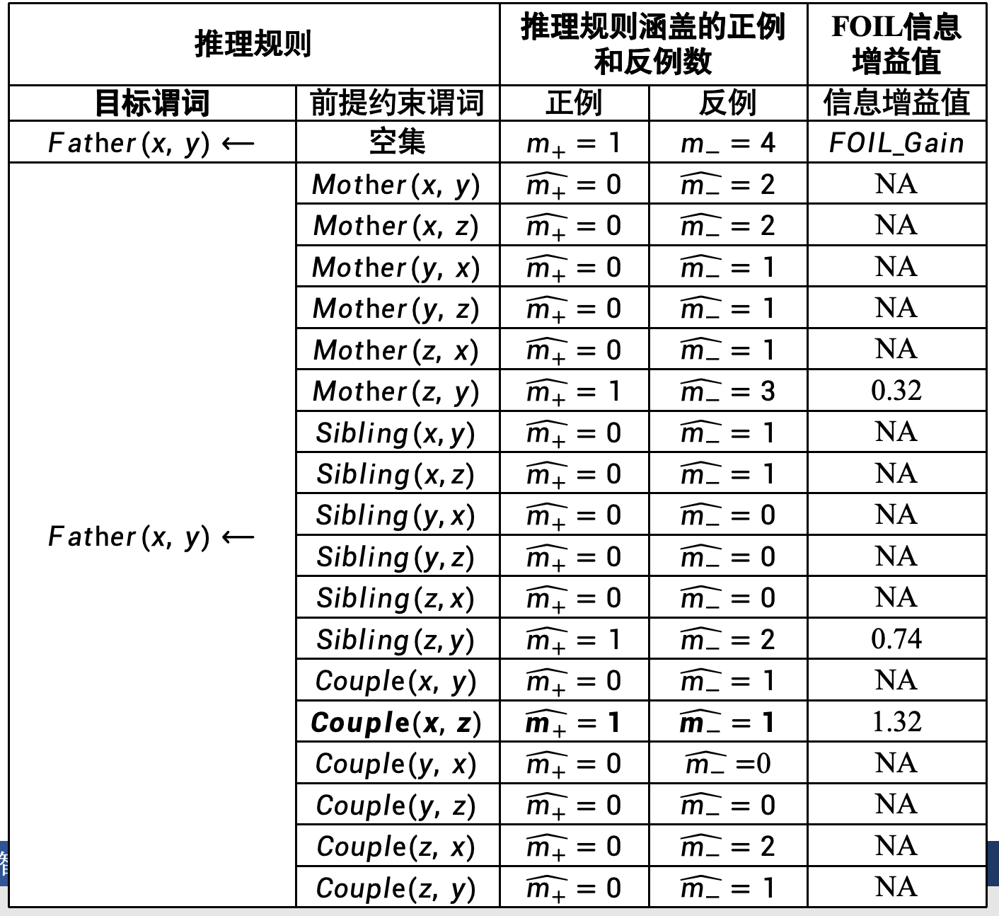
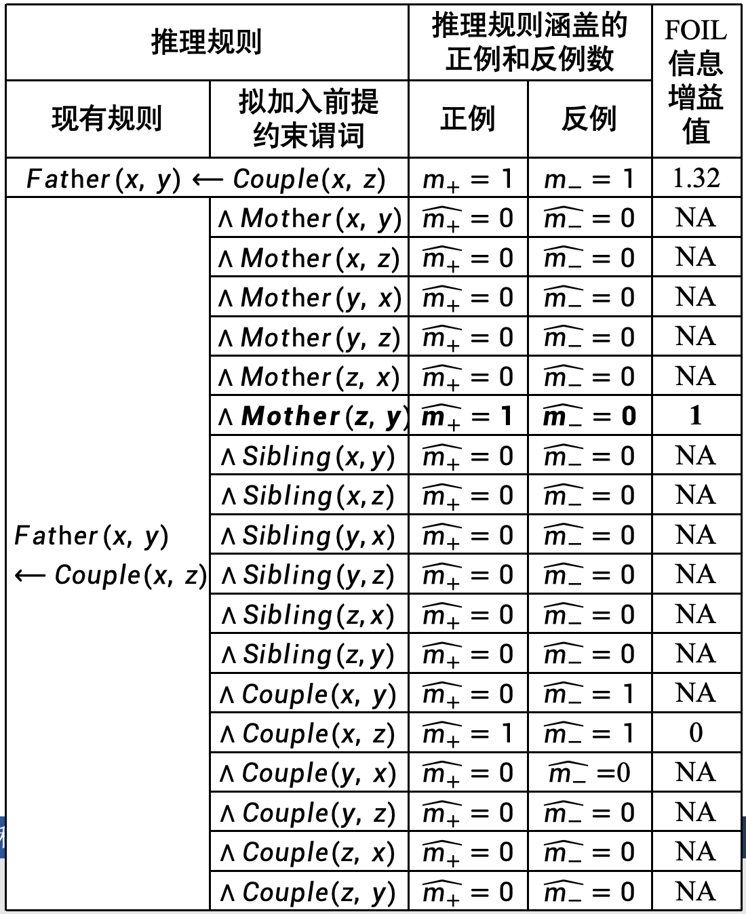
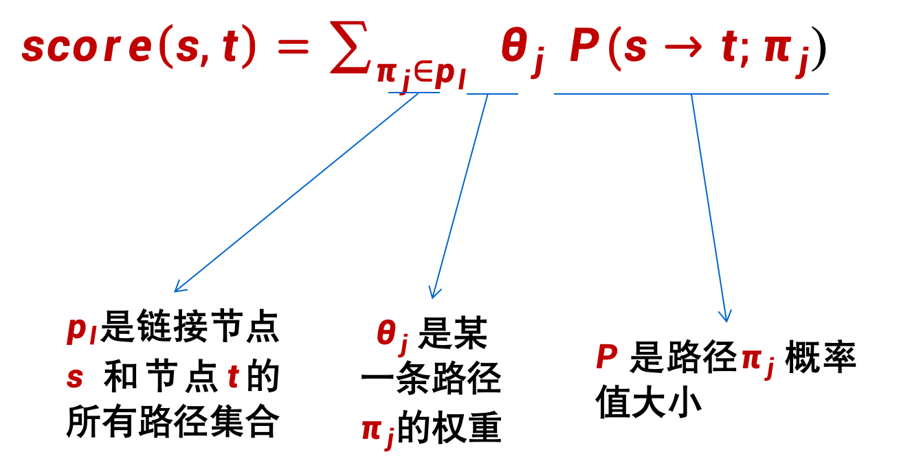
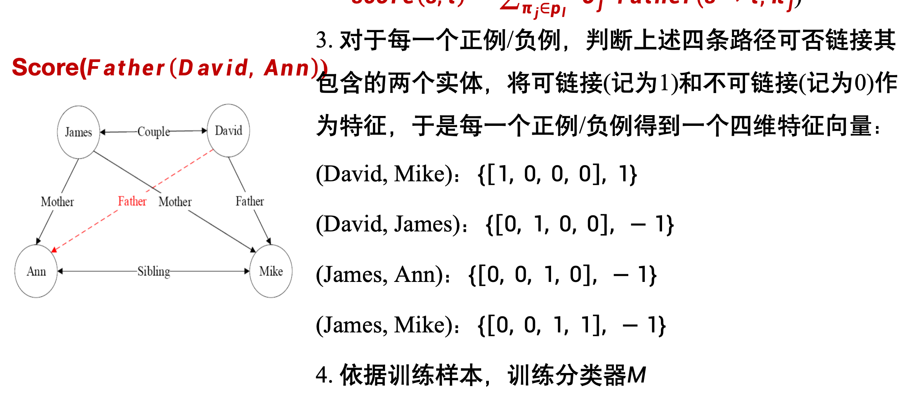

# CH1

### 形式化系统的三个性质
1. 完备性：系统能够表达所有的真命题。
2. 一致性：系统中不存在矛盾，即不能同时证明一个命题和它的否定。
3. 可判定性：系统中的每个命题都可以在有限时间内被证明为真或假。

### 三大主义
1. 符号主义
2. 联结主义
3. 行为主义

### 三种推理形式
归纳推理、演绎推理、因果推理

### 推理的三种层次
1. 关联：直接从数据中计算得到的统计相关
2. 干预（介入）：无法直接观测数据得到的因果关系，需要通过其他变量
3. 反事实；当前已经发生，但是能知道，如果不发生，会怎样

### 机器学习对数据利用的三种不同方式，可分为
1. 监督学习：通过标注数据进行训练，学习输入与输出之间的映射关系。
2. 无监督学习：通过未标注数据进行训练，寻找数据中的模式或结构。
3. 半监督学习：

### 搜索算法分类及其例子
1. 无信息搜素（盲目搜索算法）：BFS、DFS
2. 有信息搜索（启发式搜索算法）：A*算法、贪心算法
3. 对抗搜索（博弈搜索）：最大最小搜索、Alpha-Beta剪枝、蒙特卡洛树搜索

---
# CH2
逻辑推理部分不作复习了

这里注意逻辑等价的符号（三横）：

## FOIL
目标谓词 = 目标头（注意表述）

### 信息增益公式：

### 步骤
1. 首先我们有一个目标谓词，求出原本的正例和反例个数
2. 然后我们生成若干个候选谓词，并在符合这个候选谓词为正的样本中，计算目标谓词的正例和反例个数，然后计算信息增益

3. 选取信息增益最大的谓词加入约束谓词，然后继续重复上面的步骤。

4. 直到所有符合约束谓词的样本都是正例

## 路径排序

### 步骤
1. 特征抽取
    - 先生成训练样例，然后生成路径（随机游走、BFS、DFS等）
2. 特征计算
    - 计算每一个样例的特征向量，特征向量每个位置代表一类路径能否连接这个样例，然后后面是特征值，这里可以是布尔值
  
  
  
3. 分类器训练
    - 用得到的特征向量当成训练样本，特征值作为标签，训练分类器

## 其他知识推理算法
* 基于分布式表示的知识推理
* 马尔可夫逻辑网络

## 因果推理
两种模型：
* 结构因果模型

外生变量、内生变量

* 因果图

乘积分解规则

D-分离