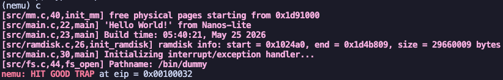
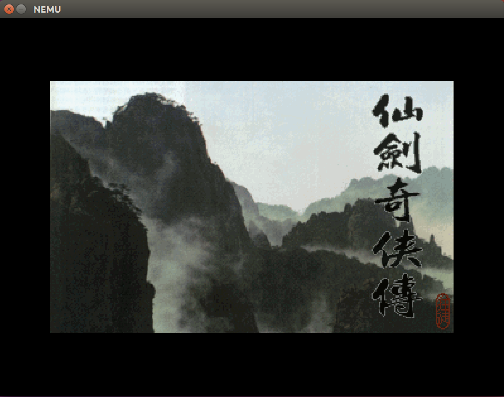
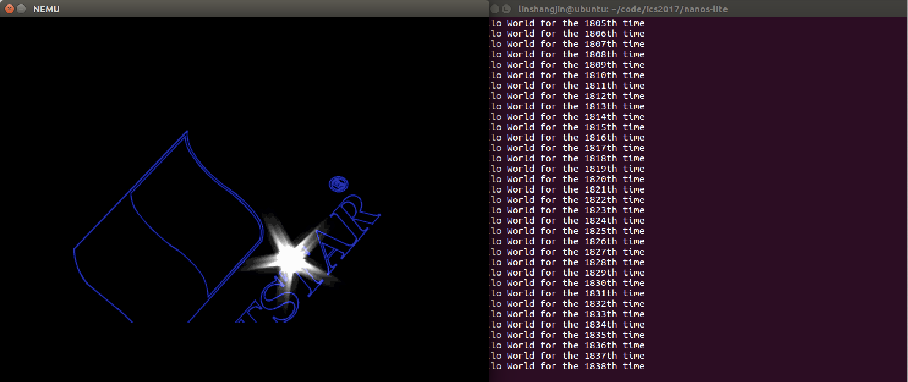
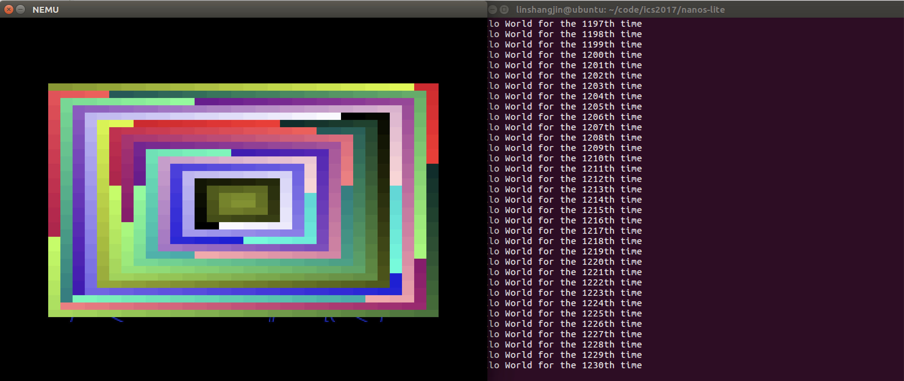
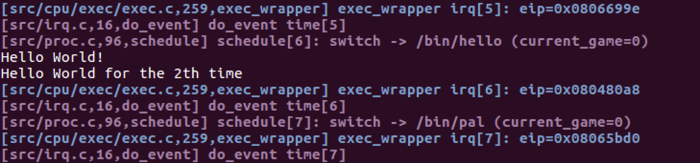

# PA4 过程记录

## 1. PA4.1 起步：先把分页硬件侧接起来

这一阶段我先不碰 `_map()`、`_umake()` 和调度，先把 `NEMU` 里和分页直接相关的硬件语义接上。这样后面打开 `HAS_PTE` 之后，至少控制寄存器和地址翻译这条链不会是空的。

本阶段改动集中在 `nemu`：

### 1.1 在 CPU 状态里加入 CR0 / CR3 / INTR

文件：

- `nemu/include/cpu/reg.h`

改动：

- 在 `CPU_state` 中加入 `CR0 cr0`
- 在 `CPU_state` 中加入 `CR3 cr3`
- 加入 `bool INTR`

思路：

- `CR0` 里最关键的是 `protect_enable` 和 `paging` 两个 bit，后面判断是否开启分页就靠它
- `CR3` 里保存页目录基址，分页翻译时要从这里开始走两级页表
- `INTR` 先保留给后面时钟中断使用，这样 `PA4` 后半段就不用再改结构体布局

### 1.2 在 restart() 里补控制寄存器初值

文件：

- `nemu/src/monitor/monitor.c`

改动：

- `cpu.cr0.val = 0x00000001`
- `cpu.cr3.val = 0`
- `cpu.INTR = false`

思路：

- 这里先按“保护模式开、分页关”的状态起步
- 后面 `mov` 到 `cr0/cr3` 之后，再真正切到分页
- 这样比较符合 `PA4` 前几步逐步推进的节奏，不会一上来就把分页硬开

### 1.3 实现 mov r2cr / mov cr2r

文件：

- `nemu/src/cpu/exec/system.c`
- `nemu/src/cpu/exec/all-instr.h`
- `nemu/src/cpu/exec/exec.c`

改动：

- 给 `all-instr.h` 增加 `mov_r2cr` 和 `mov_cr2r`
- 在 `system.c` 里只实现 `cr0` 和 `cr3`
- 在 `exec.c` 的两字节 opcode 表中加入：
  - `0x0f 0x20`：`mov crX, r32`
  - `0x0f 0x22`：`mov r32, crX`

思路：

- 这一阶段只需要支持 `cr0` 和 `cr3`
- 其它控制寄存器先不实现，遇到直接 `Assert`
- 这样足够支撑分页初始化和页目录切换

### 1.4 实现 page_translate()

文件：

- `nemu/src/memory/memory.c`

改动：

- 新增 `page_translate(vaddr_t addr, bool is_write)`

处理流程：

1. 如果 `CR0.PG=0`，直接把虚拟地址当物理地址返回
2. 否则从 `CR3.page_directory_base` 取页目录物理基址
3. 根据虚拟地址拆出：
   - PDE 索引
   - PTE 索引
   - 页内偏移
4. 读 PDE，检查 `present`
5. 置 PDE 的 `accessed`
6. 再读 PTE，检查 `present`
7. 置 PTE 的 `accessed`
8. 如果是写操作，再置 `dirty`
9. 最后拼出物理地址返回

思路：

- 这里先按最基础的两级页表来做
- 暂时不处理权限异常，只先做 `present` 检查
- `A/D` 位顺手更新掉，后面和参考实现状态更一致

### 1.5 让 vaddr_read / vaddr_write 真正走分页

文件：

- `nemu/src/memory/memory.c`

改动：

- `vaddr_read()` 不再直接调用 `paddr_read()`
- `vaddr_write()` 不再直接调用 `paddr_write()`
- 新增跨页处理逻辑

思路：

- 如果访问没有跨页，就先翻译一次再读写
- 如果访问跨页，就按字节拆开，每个字节分别做地址翻译

这样做虽然不算最快，但逻辑很稳，适合现在这个阶段先把功能接通。

## 2. 目前状态

到这里为止，`PA4.1` 的分页硬件侧最小闭环已经补上了：

- `CR0/CR3`
- `mov r2cr / mov cr2r`
- `page_translate()`
- `vaddr_read / vaddr_write` 分页支持

但这还不是完整的 `PA4`，后面还要继续补：

- `HAS_PTE`
- `_map()`
- 按页 `loader`
- `mm_brk()`
- `_umake()`
- `schedule()`
- 时钟中断和分时多任务

## 3. 当前验证情况

我在本地尝试直接编译 `nemu` 时，遇到的是环境问题，不是这批代码本身的编译错误：

```text
fatal error: 'SDL2/SDL.h' file not found
```

也就是说：

- 本地 Mac 这边当前缺少 `SDL2` 头文件环境
- 所以这一步还没有做完真正的本地编译验证
- 下一步需要切到虚拟机里重新编译 `nemu/nanos-lite`，再继续验证分页链是否能正常工作

## 4. 下一步计划

下一步准备继续做：

1. 打开 `HAS_PTE`
2. 检查 `AM` 的 `_pte_init()` 是否已经把内核映射和 `cr0/cr3` 准备好
3. 实现 `_map()`
4. 把 `loader()` 从“整段拷贝”改成“按页分配并映射”

## 5. PA4.2：把分页真正接到 AM 和 Nanos-lite

前面 `NEMU` 里虽然已经有了 `CR0/CR3` 和地址翻译，但如果 `Nanos-lite` 这边还不开 `HAS_PTE`，`AM` 这边也不去真的填页表，那分页能力还是挂在半空中。

所以这一阶段我继续做了三件事：

### 5.1 打开 `HAS_PTE`

文件：

- `nanos-lite/src/main.c`

改动：

- 取消 `HAS_PTE` 的注释

思路：

- 这样启动 `Nanos-lite` 时会先调用 `init_mm()`
- `init_mm()` 会进一步进入 `_pte_init()`
- 这一步才会真正建立内核页表，并把 `CR3/CR0.PG` 设起来

### 5.2 实现 `_map()`

文件：

- `nexus-am/am/arch/x86-nemu/src/pte.c`

改动：

- 根据 `va` 算出 PDE 索引和 PTE 索引
- 如果页表不存在，就申请一页新的页表并清零
- 填好 PDE
- 再填好 PTE，把 `va` 映射到 `pa`

处理细节：

- PDE/PTE 都设置了 `PTE_P | PTE_W | PTE_U`
- 这样后面用户地址空间映射时，页表项权限至少是可用的

思路：

- 这一步先按最小可用实现来做
- 页表不存在就现申请，不去做复杂的回收逻辑
- 目的是先把“给一个虚拟页，真能映射到一个物理页”这条主线接通

### 5.3 实现 `mm_brk()`

文件：

- `nanos-lite/src/mm.c`

改动：

- 第一次调用时初始化 `cur_brk` 和 `max_brk`
- 当 `new_brk > max_brk` 时，按页补映射
- 每次补映射时调用：

```c
_map(&current->as, (void *)brk, new_page());
```

思路：

- 堆区增长时，本质就是“多给用户进程几页可用内存”
- 当前阶段先只处理“向上长”的情况，不做回收
- 这样已经足够支撑 `malloc()/free()` 依赖的 `brk` 主线

## 6. 当前阶段结论

到这里为止，`PA4` 的分页主线已经从“只有 NEMU 侧能翻译地址”推进到了：

- `NEMU` 能识别分页
- `Nanos-lite` 启动时会打开 `HAS_PTE`
- `AM` 能通过 `_map()` 建立虚拟页到物理页的映射
- `mm_brk()` 在需要时能给堆区补页

但这还没有走到“用户程序在独立虚拟地址空间中运行”，因为后面还缺：

- `loader()` 按页加载
- `_umake()`
- `schedule()`
- 栈切换
- 时钟中断

## 7. 这一阶段的验证情况

我在本地尝试编 `nanos-lite` 时，遇到的是环境变量问题：

```text
Makefile:4: /Makefile.app: No such file or directory
```

这说明：

- 当前本地终端没有设置 `NAVY_HOME`
- `nanos-lite` 的构建环境还没配齐

因此这一步仍然需要在虚拟机上做真正编译验证。也就是说：

- 当前没有出现新的代码级编译错误
- 但这一步是否能完整通过，还要以远端 `make` 结果为准

## 8. PA4.3：修复用户程序虚拟地址空间与堆区映射问题

在继续远端调试之后，我发现系统虽然已经能进入调度，但运行现象明显不对：

- `hello` 可以持续输出
- 图形窗口能够弹出
- 但 `pal` 一直黑屏
- 更异常的是，调度日志显示切回 `/bin/pal` 时，控制流却像还停留在 `hello`

这说明问题已经不再是“分页完全没开”，而是“用户进程虽然被调度了，但它们没有真正运行在彼此独立的用户虚拟地址空间上”。

### 8.1 修复 `mm_brk()` 首次扩堆逻辑

文件：

- `nanos-lite/src/mm.c`
- `nanos-lite/src/proc.c`

问题：

我最开始的 `mm_brk()` 写法中，第一次调用时只是简单把：

```c
current->cur_brk = current->max_brk = new_brk;
```

然后直接返回，并没有真的为首次扩展出来的堆区建立页映射。

而 `libos` 里的 `_sbrk()` 第一次调用时，传给内核的 `new_brk` 已经是“扩大之后”的堆顶，因此如果内核在这一步不补映射，后续用户程序第一次访问堆时就会踩到未映射区域。

修复思路：

- 在 `load_prog()` 中为每个新进程记录初始 `heap_start`
- 将 `pcb[i].cur_brk` 和 `pcb[i].max_brk` 初始化为这个值
- `mm_brk()` 不再单独 special-case 第一次调用
- 只要 `new_brk > current->max_brk`，就从旧的 `max_brk` 开始按页补映射

这样做以后，堆区增长逻辑才和用户态 `_sbrk()` 的语义一致。

### 8.2 修复新页未清零导致的脏数据问题

文件：

- `nanos-lite/src/mm.c`

问题：

之前 `new_page()` 只是顺序返回一页物理内存，但没有清零。这样会带来一串隐蔽问题：

- 用户程序最后一页只读入了部分文件内容，页尾残留旧数据
- 用户栈只写了顶上的几个参数槽位，其余内容不确定
- 新扩展出来的堆页也不是零页

修复：

- 在 `new_page()` 中分配后立刻 `memset(p, 0, PGSIZE)`

这样至少保证：

- 程序按页加载时不会带上脏尾巴
- 用户栈初始内容可控
- 新堆页符合“新分配页默认全 0”的预期

### 8.3 定位到真正导致 “只有 hello、pal 黑屏” 的根因

在远端虚拟机中继续运行后，我通过日志发现：

- `schedule()` 确实在 `pal` 和 `hello` 之间切换
- 时钟中断也在工作
- 但切回 `pal` 时，EIP 落点和输出行为仍然像 `hello`

继续检查后定位到根因：

```text
用户程序仍然被链接并加载到 0x4000000
而内核页表共享了低地址恒等映射
```

结果就是：

- 第一个用户进程 `pal` 被映射到 `0x4000000`
- 第二个用户进程 `hello` 也被映射到 `0x4000000`
- 第二个进程的映射覆盖了第一个进程
- 调度虽然切换了 PCB 和页表，但两个进程实际都落在共享低地址区域里

这正是讲义中提到的那个“看似已经开了分页，其实里面暗藏杀机”的问题。

### 8.4 按讲义要求把用户程序入口改到 `0x8048000`

文件：

- `navy-apps/Makefile.compile`
- `nanos-lite/src/loader.c`

修复：

- 将 `navy-apps/Makefile.compile` 中的：

```text
-Ttext 0x4000000
```

改为：

```text
-Ttext 0x8048000
```

- 将 `loader.c` 中的：

```c
#define DEFAULT_ENTRY ((void *)0x4000000)
```

改为：

```c
#define DEFAULT_ENTRY ((void *)0x8048000)
```

这样修改之后：

- 用户程序统一运行在 `0x8048000` 附近
- 这个地址落在 `_protect()` 设置的用户地址空间范围内
- 它不再和内核低地址恒等映射重叠
- 不同用户进程终于能够在各自页表中拥有彼此独立的映射

这一步是本次调试中最关键的修复。

## 9. 远端虚拟机验证过程

由于本地环境缺少完整运行条件，这一阶段的有效验证是在虚拟机中完成的。

远端路径：

```text
~/code/ics2017
```

运行方式：

```bash
export NEMU_HOME=~/code/ics2017/nemu
export AM_HOME=~/code/ics2017/nexus-am
export NAVY_HOME=~/code/ics2017/navy-apps

cd ~/code/ics2017/nanos-lite
make ARCH=x86-nemu update
make ARCH=x86-nemu run
```

进入 `(nemu)` 后执行：

```text
c
```

### 9.1 修复前的现象

修复前远端的现象是：

- `hello` 能持续打印
- `schedule()` 也在切换
- 图形窗口弹出但 `pal` 黑屏
- 本质上是两个进程都被装到了同一片低地址虚拟区

### 9.2 修复后的关键日志

把入口地址修到 `0x8048000` 之后，远端日志出现了这些关键变化：

- `schedule[0]: first -> /bin/pal`
- 时钟中断打断时的 `eip` 已经变成 `0x08048000`
- 切回 `pal` 后不再继续输出 `hello`
- `pal` 开始输出：
  - `game start!`
  - `VIDEO_Init success`
  - `loading fbp.mkf`
  - `loading mgo.mkf`
  - `loading data.mkf`
  - `PAL_InitGlobals success`
  - `PAL_InitFont success`
  - `PAL_InitUI success`

这些日志说明：

- `pal` 已经真正运行在自己的虚拟地址空间上
- 不是“调度到了 pal 但实际执行的还是 hello”
- 文件系统、显存设备、事件设备和堆区访问都已经进入可工作的阶段

此外，在加入时钟中断并完成真正的抢占式调度之后，远端日志里还可以持续看到：

- `exec_wrapper irq[...]`
- `do_event time[...]`
- `schedule[...]`

例如：

```text
[src/cpu/exec/exec.c,259,exec_wrapper] exec_wrapper irq[0]: eip=0x08048000
[src/irq.c,16,do_event] do_event time[0]
[src/proc.c,96,schedule] schedule[1]: switch -> /bin/pal (current_game=0)
```

以及后续：

```text
[src/proc.c,96,schedule] schedule[6]: switch -> /bin/hello (current_game=0)
[src/proc.c,96,schedule] schedule[7]: switch -> /bin/pal (current_game=0)
```

这说明：

- NEMU 中的时钟中断确实被周期性触发
- AM 已经将其包装成 `_EVENT_IRQ_TIME`
- Nanos-lite 在收到时钟中断事件后调用 `schedule()`
- 因此当前系统已经不再依赖系统调用返回来切换进程，而是实现了真正的抢占式分时多任务

## 10. 当前进度判断

结合讲义目标和远端验证结果，我认为当前进度已经达到并超过了“让用户程序运行在分页机制上”这一阶段。

目前已经确认完成的部分：

- `NEMU` 侧分页硬件支持
- `CR0/CR3`
- `page_translate()`
- `vaddr_read()/vaddr_write()` 分页访问
- `HAS_PTE`
- `AM` 中 `_map()`
- `loader()` 按页加载用户程序
- `mm_brk()` 为堆区补映射
- 用户程序入口迁移到 `0x8048000`
- `pal` 在分页机制下开始正常初始化
- `pal` 和 `hello` 已经可以分时运行
- 时钟中断已经在驱动调度

也就是说，当前状态已经不只是：

```text
dummy 在虚拟地址空间上 GOOD TRAP
```

而是已经进入了：

```text
pal + hello 分时运行
```

## 11. 目前还遗留的问题

虽然从日志上看 `pal` 已经真正执行起来了，但画面表现仍可能存在问题，例如：

- 本地或虚拟机图形环境下窗口显示异常
- 画面更新效果和预期不一致
- 后续 `videotest` / `F12` 切换功能还未完全收尾

这些问题已经不属于“分页机制是否建立成功”的主问题，而更偏向：

- 图形输出链路
- 多任务展示逻辑
- 设备写屏行为

因此当前报告中的结论应当是：

```text
分页机制下运行 pal 这一阶段已经打通
后续主要工作转向显示效果和展示功能完善
```

## 12. PA4.4：完成 `videotest` 加载与 `F12` 切换展示

在讲义最后一个展示阶段中，还要求系统能够：

- 额外加载第三个用户程序 `/bin/videotest`
- 在 `events_read()` 中识别 `F12`
- 在 `pal` 和 `videotest` 之间切换
- `hello` 继续作为后台进程参与调度

这一阶段我只做了最小修改，不再改动分页和调度主线。

### 12.1 加载第三个用户程序 `videotest`

文件：

- `nanos-lite/src/main.c`

改动：

- 把原来注释掉的：

```c
load_prog("/bin/videotest");
```

恢复启用

这样启动后，系统中就不再只是：

```text
pal + hello
```

而是变成：

```text
pal + hello + videotest
```

### 12.2 保留现有调度框架，修掉 `F12` 路径里的不稳定硬编码

文件：

- `nanos-lite/src/device.c`

问题：

我原来在 `F12` 处理路径中写过这样一段逻辑：

```c
fs_lseek(5, 0, 0);
```

它默认假设：

- `/proc/dispinfo` 恰好对应文件描述符 `5`

这种写法不稳定，依赖文件打开顺序和当前进程行为，不能作为可靠实现。

修复：

- 去掉这条对固定文件描述符的硬编码依赖
- `F12` 被按下时只做一件事：翻转 `current_game`

也就是：

```c
current_game = (current_game == 0 ? 1 : 0);
```

调度器本身已经有这套逻辑：

- `hello` 固定作为后台进程
- 另一个时间片在 `pal` 和 `videotest` 之间切换

因此只要把 `current_game` 切换好，后续调度自然就会切换到不同游戏进程。

### 12.3 远端验证结果

这一阶段完成后，我把修改同步到远端虚拟机，并确认：

- `/bin/videotest` 已经被实际加载
- 启动日志中能看到：

```text
Pathname: /bin/videotest
```

- `pal + hello` 原有分时运行能力没有被破坏

随后由本地窗口交互验证：

- 默认状态下可以看到 `pal + hello`
- 按下 `F12` 后可以成功切换到 `videotest + hello`

这说明讲义最后要求的展示功能已经实现完成。

### 12.4 当前阶段结论

到这里为止，PA4 的主线功能已经基本齐全：

- 分页机制
- 用户进程独立虚拟地址空间
- `mm_brk()` 堆区映射
- `_umake()` 与上下文切换
- 时钟中断驱动的分时调度
- `pal + hello` 分时运行
- `F12` 在 `pal` / `videotest` 间切换

也就是说，从讲义要求来看，PA4 的实现目标已经基本完成。

## 13. PA4.5：加入优先级调度，降低 `hello` 对游戏性能的影响

在 `pal` 和 `hello` 已经可以分时运行之后，会很容易观察到一个现象：

- `hello` 会持续高频输出
- 游戏进程虽然仍然在运行
- 但画面流畅度明显下降

这正是讲义中提到的“分时的本质”：

```text
进程并不是真正同时运行，
而是在轮流占用处理器。
```

如果两个进程严格按 `1:1` 的频率切换，那么 `hello` 这种“持续打印字符串”的进程会占掉过多时间片，直接影响 `pal` 的表现。

因此，这一阶段的目标不是再去改分页或中断，而是做一个更符合展示需求的调度策略：

```text
让游戏进程连续多跑几个时间片，
hello 只偶尔运行一次，以证明它还活着。
```

### 13.1 修改 `schedule()` 的调度比例

文件：

- `nanos-lite/src/proc.c`

改动：

- 新增：

```c
#define GAME_SLICE_BUDGET 5
```

- 在 `schedule()` 中加入 `game_slice_count`
- 对三进程场景使用“游戏优先”的频率分配

调度逻辑从原来的严格轮转：

```text
game -> hello -> game -> hello
```

改成：

```text
game -> game -> game -> game -> game -> hello
```

这里的 `game` 指：

- `current_game == 0` 时是 `pal`
- `current_game == 1` 时是 `videotest`

而 `hello` 始终固定为后台进程。

### 13.2 设计思路

这样设计的原因是：

- `hello` 的存在意义只是证明分时多任务确实在工作
- 它不需要高频执行
- `pal` 和 `videotest` 属于需要持续刷新画面的进程
- 它们更依赖时间片连续性

因此，与其做完全公平调度，不如做一个带有明显展示导向的轻量优先级调度：

- 保证 `hello` 不会饿死
- 同时尽量减少它对图形程序性能的干扰

这也符合讲义里“让仙剑奇侠传尽量保持原来的性能”的要求。

### 13.3 实际运行效果

修改之后，运行现象有明显改善：

- `hello` 仍然会持续输出
- 但输出频率明显下降
- `pal` 或 `videotest` 的运行流畅度比 `1:1` 轮转时更好

这说明：

- 时钟中断驱动的抢占式调度仍然在工作
- 优先级调度已经成功改变了时间片分配比例
- 展示型进程的体验得到了改善

### 13.4 当前阶段结论

到这一阶段为止，PA4 不仅完成了“能分时运行”的基本要求，还进一步做到了：

- 用时钟中断驱动多进程轮转
- 用 `F12` 在两个图形进程之间切换
- 用优先级调度降低后台 `hello` 对前台图形程序的干扰

因此，从实验主线和讲义要求来看，PA4 的功能实现可以视为已经完成。

## 14. 截图记录

下面两张图建议保留到报告中：

1. `pal` 和 `hello` 同时运行的终端/窗口截图
2. `pal` 开始加载资源并输出初始化日志的截图

当前报告目录中已有截图文件：

- `imgs/pa4-paging-loader-good-trap.png`
- `imgs/pa4-pal-paging-startup.png`

可在这里插入：





本次新增的两张截图建议命名为：

- `imgs/pa4-pal-hello-before-f12.png`
- `imgs/pa4-videotest-hello-after-f12.png`
- `imgs/pa4-timer-interrupt-log.png`

含义分别是：

- 按下 `F12` 前：`pal + hello`
- 按下 `F12` 后：`videotest + hello`
- 时钟中断与抢占式调度日志验证图

可继续在这里插入：







如果你后续还要补更多截图，可以继续放到：

```text
PA报告/PA4-report/imgs/
```

然后在这里追加引用。

## 15. 讲义问答题

### 15.1 为什么 `_protect()` 创建用户虚拟地址空间时必须拷贝内核映射

在 `_protect()` 中，框架代码会把内核页表中的映射复制到新建的用户页目录里。这个操作的意义是：

```text
用户地址空间不只是给用户程序自己用，
它还必须保证“用户程序陷入内核之后，内核仍然能在当前页表下正常执行”。
```

如果把这段“拷贝内核映射”的代码注释掉，会发生的问题是：

1. 新创建的用户地址空间里只剩下用户自己的映射，没有内核映射。
2. 当用户程序运行时，CPU 当前使用的是这个用户进程自己的页表。
3. 一旦发生系统调用、异常或时钟中断，控制流会陷入内核。
4. 但此时还没有切换到别的页表，CPU 仍然在使用这个用户页表。
5. 如果这个页表里没有内核代码、内核栈、设备映射等对应的虚拟地址，那么内核一进入就无法正确取指、访存或访问栈。
6. 最终就会触发页表项不存在、地址翻译失败，系统直接崩溃。

所以本质原因是：

```text
陷入内核并不会自动切走当前页表。
如果当前页表里没有内核映射，内核根本无法在这个地址空间里运行。
```

这也是为什么用户地址空间必须包含“两部分内容”：

- 用户程序自己的映射
- 内核运行所需的公共映射

结合这次 PA4 的实现过程来看，这个结论非常关键。因为我们后续的 `schedule()`、系统调用处理、时钟中断处理，本质上都依赖“当前进程的页表不仅能访问用户区，也能支撑内核代码继续执行”。

为了验证这一点，我还做了一次真实实验：临时注释掉 `_protect()` 中这段代码：

```c
for (int i = 0; i < NR_PDE; i ++) {
  updir[i] = kpdirs[i];
}
```

然后重新同步到远端虚拟机并运行。运行结果是：

- 系统启动本身还能继续
- `/bin/pal` 和 `/bin/hello` 也都能被加载
- `schedule()` 第一次切到 `/bin/pal` 时，系统立刻崩溃

远端的真实报错为：

```text
PDE for vaddr 0x0010172c is not present
nemu: src/memory/memory.c:54: page_translate: Assertion `pde.present' failed.
```

这个现象说明：

- 当前页表已经切换成用户进程自己的页表
- 但该页表中没有拷贝内核映射
- 内核随后访问到地址 `0x0010172c` 对应的内核区域时，发现对应 PDE 根本不存在
- 因此在 `page_translate()` 中直接因为 `present=0` 断言失败

这个实验结果和上面的分析完全一致，也直接证明了：

```text
用户地址空间如果不包含内核映射，
那么一旦陷入内核或发生调度，内核就无法在当前页表下继续执行。
```

### 15.2 为什么分页机制下必须在 `mm_brk()` 中给新堆区补映射

在实现分页之前，用户程序直接运行在一个近似“平坦”的地址空间里，`0x4000000` 以上的大块区域并没有经过真正的页级管理，因此 `mm_brk()` 直接返回 `0` 也不会立刻出问题，用户程序看起来仍然可以继续使用更高地址的内存。

但在分页机制下，这种做法就不成立了。

原因是：

1. 用户程序现在访问的是虚拟地址。
2. 一个虚拟地址想要真正可用，必须在页表中有对应的虚拟页到物理页映射。
3. `brk()` 的语义是把进程堆顶向上扩展。
4. 当堆顶增长后，如果新覆盖到的那些虚拟页没有被映射，程序一旦访问这些新堆区，就会在地址翻译时找不到有效页表项。
5. 这样就会导致页错误，程序无法正常运行。

因此，`mm_brk()` 在分页机制下不能再“假装成功”，而必须真的完成下面这些工作：

- 判断新的 `brk` 是否超过当前 `max_brk`
- 找出哪些虚拟页是新增覆盖到的
- 为这些虚拟页分配物理页
- 调用 `_map()` 将这些虚拟页映射到新分配的物理页

这就是讲义里那句“把新申请的堆区映射到虚拟地址空间中”的真正含义。

在我的实现里，这部分逻辑是：

- 每个进程在 `load_prog()` 时记录自己的 `cur_brk` 和 `max_brk`
- `mm_brk()` 发现 `new_brk > current->max_brk` 时，从旧的 `max_brk` 开始按页向上补映射
- 每补一页就调用一次 `_map(&current->as, ...)`

这里还需要特别注意页对齐问题。因为页表映射的最小粒度是页，而不是字节，所以：

- `brk` 本身可以是不对齐的字节地址
- 但真正传给 `_map()` 的虚拟页起点必须按页对齐处理

因此我在实现中是从：

```c
PGROUNDUP(current->max_brk)
```

开始向上补页，这样可以保证只给“新跨入的那些页”建立映射。

最终结论是：

```text
分页机制下，堆区增长不只是修改一个数值，
而是必须同步补齐对应虚拟页的物理页映射。
否则 brk() 虽然返回成功，程序实际上仍然无法使用新增堆区。
```

这道题在这次调试中其实也遇到了真实问题。我最开始的实现里，`mm_brk()` 对“第一次调用”做了一个错误的特殊处理：

```c
if (current->cur_brk == 0) {
  current->cur_brk = current->max_brk = new_brk;
  return 0;
}
```

这段代码的问题在于：

- 它只是更新了堆顶数值
- 但没有给第一次扩展出来的那一段堆区建立任何页映射

而用户态 `libos` 中的 `_sbrk()` 第一次调用时，传给内核的 `new_brk` 已经是“扩大之后”的堆顶地址，因此如果内核在这里直接返回成功，就会出现一种假象：

```text
brk() 返回成功了，
但新堆区对应的虚拟页其实根本没有映射。
```

这样一来，后续程序一旦真正访问这块新堆区，就会在地址翻译阶段触发页错误。

也正因为如此，我后来改成了下面这种思路：

- 在 `load_prog()` 中就记录好进程的初始 heap 起点
- 令 `cur_brk` 和 `max_brk` 从这个初始值开始
- `mm_brk()` 不再单独特殊处理第一次调用
- 只要 `new_brk > max_brk`，就从旧的 `max_brk` 开始按页补映射

这个修改之后，`mm_brk()` 的行为才真正符合分页机制下堆扩展的要求。

因此，这道问答不仅是理论要求，也是这次 PA4 调试中一个真实踩到的坑：如果 `mm_brk()` 只是“返回 0”或者“只更新数值不补页”，那么用户程序看上去堆扩展成功了，实际上仍然无法安全使用那片新增堆区。

## 16. 必答题：分页机制和硬件中断如何共同支撑 `pal` 与 `hello` 分时运行

这道题如果只从“操作系统概念”层面回答，其实并不够。因为在 PA4 中，分页机制和时钟中断并不是孤立存在的两个知识点，而是分别承担了多任务系统中的两个核心角色：

- `分页机制` 负责解决“多个进程如何共存而不互相覆盖”
- `硬件中断 + 上下文切换` 负责解决“多个进程如何轮流获得 CPU”

只有这两部分都接起来，`pal` 和 `hello` 才能在我们搭建的 `Nanos-lite + AM + NEMU` 系统中分时运行。

下面结合代码，从三层系统结构来说明这个过程。

### 16.1 第一层：NEMU 负责提供“分页硬件”和“中断硬件”

#### 16.1.1 NEMU 如何支撑分页机制

在 NEMU 中，分页最关键的代码位于：

- `nemu/src/memory/memory.c`
- `nemu/include/cpu/reg.h`

首先，CPU 状态中加入了 `CR0` 和 `CR3`，其中：

- `CR0.PG` 表示是否开启分页
- `CR3` 保存页目录基地址

真正完成地址转换的是 `memory.c` 中的 `page_translate()`，见：

- `nemu/src/memory/memory.c:42`

它做的事情是：

1. 检查当前是否处于保护模式并且开启了分页
2. 从 `CR3` 中取出页目录物理基地址
3. 从虚拟地址中拆出：
   - PDE 索引
   - PTE 索引
   - 页内偏移
4. 读取 PDE 和 PTE
5. 检查 `present`
6. 更新 `accessed` / `dirty`
7. 得到最终物理地址

对应代码片段如下：

```c
static paddr_t page_translate(vaddr_t addr, bool is_write) {
  if (!cpu.cr0.protect_enable || !cpu.cr0.paging) {
    return addr;
  }
  ...
  pde.val = paddr_read(...);
  Assert(pde.present, ...);
  ...
  pte.val = paddr_read(...);
  Assert(pte.present, ...);
  ...
  return (pte.page_frame << 12) | page_off;
}
```

然后，`vaddr_read()` 和 `vaddr_write()` 不再直接访问物理地址，而是先调用 `page_translate()`：

- `nemu/src/memory/memory.c:71`
- `nemu/src/memory/memory.c:85`

这意味着：

```text
用户程序执行过程中所有使用到的虚拟地址，
最终都要经过 NEMU 的页表翻译才能访问到真正的物理内存。
```

也正因为如此，虽然 `pal` 和 `hello` 都认为自己运行在固定虚拟地址（最终改为 `0x8048000` 附近），它们仍然能被映射到不同物理页中，从而彼此隔离。

#### 16.1.2 NEMU 如何支撑时钟中断

在 NEMU 中，时钟中断的作用是“把 CPU 周期性地从当前进程手里抢回来”。

关键代码位于：

- `nemu/include/cpu/reg.h`
- `nemu/src/cpu/intr.c`
- `nemu/src/cpu/exec/exec.c`

第一步是在 `CPU_state` 中加入：

```c
bool INTR;
```

它用来模拟 CPU 的中断引脚状态。

第二步是在设备侧把中断请求抛给 CPU：

- `nemu/src/cpu/intr.c`

```c
void dev_raise_intr() {
  cpu.INTR = true;
}
```

第三步是在 `exec_wrapper()` 末尾轮询这个中断引脚：

- `nemu/src/cpu/exec/exec.c:256`

```c
if (cpu.INTR && cpu.IF) {
  cpu.INTR = false;
  raise_intr(TIMER_IRQ, cpu.eip);
  update_eip();
}
```

也就是说，每执行完一条指令，NEMU 都会检查：

- 有没有设备把 `INTR` 拉高
- 当前 `IF` 是否允许响应可屏蔽中断

如果满足条件，就触发时钟中断。

第四步是在 `raise_intr()` 中模拟“处理器进入中断”的行为：

- `nemu/src/cpu/intr.c`

```c
rtl_push(&cpu.eflags);
...
cpu.IF = 0;
decoding.jmp_eip = handler;
```

这里有两个关键点：

1. 保存中断现场
2. 将 `IF` 清零，避免中断嵌套破坏当前现场

所以，从 NEMU 这一层来看：

- 分页机制负责“地址空间隔离”
- 时钟中断负责“抢占 CPU”

这两部分共同提供了多任务系统所需的最底层“硬件语义”。

### 16.2 第二层：AM 负责把硬件语义包装成地址空间和异常事件接口

AM 在 PA4 中主要承担两类工作：

1. 把页表操作封装成地址空间接口
2. 把硬件中断/异常封装成统一的事件接口

#### 16.2.1 AM 如何为每个进程建立地址空间

对应文件：

- `nexus-am/am/arch/x86-nemu/src/pte.c`

启动时，`_pte_init()` 先建立内核页表：

- `pte.c:17`

它会：

- 初始化 `kpdirs`
- 填写内核的恒等映射
- 设置 `CR3`
- 打开 `CR0.PG`

随后，当 Nanos-lite 为一个新进程创建地址空间时，会调用 `_protect()`：

- `pte.c:50`

```c
void _protect(_Protect *p) {
  PDE *updir = (PDE*)(palloc_f());
  p->ptr = updir;
  for (int i = 0; i < NR_PDE; i ++) {
    updir[i] = kpdirs[i];
  }
  p->area.start = (void*)0x8000000;
  p->area.end = (void*)0xc0000000;
}
```

这里的意义是：

- 为新进程分配一份自己的页目录
- 拷贝内核映射
- 指定用户可用虚拟地址区间

真正把“某个虚拟页映射到某个物理页”的操作由 `_map()` 完成：

- `pte.c:69`

```c
void _map(_Protect *p, void *va, void *pa) {
  ...
  if (pdir[pde_idx] & PTE_P) {
    ptab = (PTE *)PTE_ADDR(pdir[pde_idx]);
  } else {
    ptab = (PTE *)palloc_f();
    memset(ptab, 0, PGSIZE);
    pdir[pde_idx] = (uintptr_t)ptab | PTE_P | PTE_W | PTE_U;
  }
  ptab[pte_idx] = ((uintptr_t)pa & ~0xfff) | PTE_P | PTE_W | PTE_U;
}
```

这说明：

```text
Nanos-lite 并不直接手工操作页表，
而是通过 AM 提供的 _protect() / _map() / _switch() 接口来管理地址空间。
```

#### 16.2.2 AM 如何把中断包装成统一事件

对应文件：

- `nexus-am/am/arch/x86-nemu/src/trap.S`
- `nexus-am/am/arch/x86-nemu/src/asye.c`

在 `trap.S` 中，不同中断源最终都会跳到 `asm_trap`，时钟中断入口是：

- `trap.S:5`

```asm
.globl vectime;  vectime:  pushl $0;  pushl $0x20; jmp asm_trap
```

而在 `asye.c` 中，`irq_handle()` 会根据 `tf->irq` 把它识别成 `_EVENT_IRQ_TIME`：

- `asye.c:16`

```c
switch (tf->irq) {
  case 0x80: ev.event = _EVENT_SYSCALL; break;
  case 0x81: ev.event = _EVENT_TRAP; break;
  case 0x20: ev.event = _EVENT_IRQ_TIME; break;
  default: ev.event = _EVENT_ERROR; break;
}
```

这一步很关键，因为它把“底层中断号”翻译成了操作系统更容易处理的“事件类型”。

此外，`asm_trap` 在从 `irq_handle()` 返回后不会继续使用原来的栈，而是：

```asm
movl %eax, %esp
popal
addl $8, %esp
iret
```

这意味着：

- `irq_handle()` 返回哪个进程的 trap frame
- `asm_trap` 就切到哪个进程的栈
- `iret` 后运行的就是那个进程

也就是说，AM 完成了“上下文切换的汇编骨架”。

### 16.3 第三层：Nanos-lite 负责进程管理、程序加载和调度决策

如果说 NEMU 提供“硬件能力”，AM 提供“抽象接口”，那么 Nanos-lite 负责的就是：

- 创建进程
- 装载程序
- 扩展堆区
- 保存上下文
- 选择下一个要运行的进程

#### 16.3.1 Nanos-lite 如何让 `pal` 和 `hello` 拥有独立地址空间

对应文件：

- `nanos-lite/src/proc.c`
- `nanos-lite/src/loader.c`
- `nanos-lite/src/mm.c`

当 `load_prog()` 被调用时：

- `proc.c:23`

```c
_protect(&pcb[i].as);
uintptr_t entry = loader(&pcb[i].as, filename);
```

也就是说，每个进程都先创建自己的地址空间，然后再把程序装进去。

`loader()` 则不再是 PA3 那种“把整个程序直接读到固定物理地址”，而是按页进行：

- 申请物理页
- `_map(as, va, pa)`
- `fs_read(fd, pa, len)`

这样 `pal` 和 `hello` 虽然都从 `0x8048000` 附近开始执行，但实际上落到的是不同物理页，因此不会互相覆盖。

同时，`mm_brk()` 还会在堆区增长时继续补映射，这保证了 `pal` 这类复杂程序在运行过程中申请新堆空间时仍然能工作。

#### 16.3.2 Nanos-lite 如何为新进程准备初始上下文

新进程第一次被调度时，并没有真实的中断现场，因此需要人工构造。

这个工作由 AM 的 `_umake()` 完成：

- `pte.c:90`

```c
tf->eip = (uintptr_t)entry;
tf->cs = 0x8;
tf->eflags = 0x202;
tf->esp = usp;
```

而 `load_prog()` 会把返回的 trap frame 保存到 PCB 中：

- `proc.c:55`

```c
pcb[i].tf = _umake(&pcb[i].as, ustack, kstack, (void *)entry, NULL, NULL);
```

这意味着：

- 每个进程都有自己的 `tf`
- 每个进程也有自己的页表 `as`
- 调度器只要切换 `tf + as`，就能把 CPU 交给另一个进程

#### 16.3.3 Nanos-lite 如何根据时钟中断进行调度

对应文件：

- `nanos-lite/src/irq.c`
- `nanos-lite/src/proc.c`

在 `irq.c` 中，收到 `_EVENT_IRQ_TIME` 后：

- `irq.c:14`

```c
case _EVENT_IRQ_TIME:
  Log("do_event time[%d]", time_log_cnt);
  return schedule(r);
```

这表示：

```text
每次时钟中断到来时，
Nanos-lite 都会调用 schedule() 决定下一个运行的进程。
```

而 `schedule()` 做的事情是：

- `proc.c:62` 先保存当前进程 `tf`
- 根据调度策略选出下一个 PCB
- `_switch(&current->as)` 切换页表
- 返回目标进程的 `tf`

关键代码如下：

```c
if (current != NULL) {
  current->tf = prev;
}
...
_switch(&current->as);
return current->tf;
```

这样一来：

- 页表切换保证“接下来访问的是另一个进程的地址空间”
- trap frame 切换保证“接下来恢复的是另一个进程的寄存器现场”

这两者缺一不可。

### 16.4 为什么必须同时有“分页机制”和“硬件中断”

现在可以把整条链路串起来看：

#### 16.4.1 如果只有分页，没有中断

如果只有分页，那么：

- `pal` 和 `hello` 可以拥有彼此独立的虚拟地址空间
- 它们不会互相覆盖

但是：

- 一旦某个程序进入死循环
- 如果它不主动系统调用
- 操作系统就拿不回 CPU

此时最多只能说“支持多进程共存”，还不能说“支持分时多任务”。

#### 16.4.2 如果只有中断，没有分页

如果只有中断，那么：

- 操作系统可以周期性地把 CPU 抢回来
- 也可以轮流切换不同现场

但是：

- `pal` 和 `hello` 都会认为自己运行在同一个链接地址
- 一个程序的代码和数据会覆盖另一个程序
- 根本无法稳定共存

此时最多只能说“能切换执行流”，还不能说“多个进程有独立运行空间”。

#### 16.4.3 两者结合后的完整效果

只有把两者结合起来，系统才真正具备分时多任务能力：

1. `分页机制`
   - 给 `pal` 和 `hello` 各自独立的虚拟地址空间
   - 即使它们都从 `0x8048000` 开始执行，也会落到不同物理页
   - 因此二者可以同时存在于内存中

2. `硬件中断`
   - 每隔 10ms 左右打断当前进程
   - 操作系统在中断中获得控制权
   - 调用 `schedule()` 选择另一个进程

3. `上下文切换`
   - 保存旧进程的 trap frame
   - 切换到新进程的页表
   - 切换到新进程的 trap frame
   - `iret` 后恢复它的执行

最终用户看到的现象就是：

```text
pal 在运行的同时，hello 也会持续输出，
它们看起来像是在“同时运行”，
但本质上是时钟中断驱动下的快速轮转执行。
```

### 16.5 结合本次实验的实际验证现象

这套机制并不只是代码层面“看起来正确”，而是在运行日志中能够直接观察到：

1. `exec_wrapper irq[...]`
   - 说明时钟中断正在 NEMU 中被触发

2. `do_event time[...]`
   - 说明 AM 已经把中断包装成 `_EVENT_IRQ_TIME`
   - Nanos-lite 已经收到时钟中断事件

3. `schedule[...]`
   - 说明调度器正在根据时钟中断切换进程

4. `Hello World for the ... time`
   - 说明 `hello` 持续获得时间片

5. `game start!`、`VIDEO_Init success`、`PAL_Init...`
   - 说明 `pal` 也在持续获得时间片并推进执行

这几类日志同时出现，正好从“硬件中断触发”“事件传递”“调度决策”“用户程序实际运行”四个层面证明了整个分时多任务链路已经贯通。

### 16.6 最终总结

因此，这道必答题可以概括为：

```text
分页机制解决的是“多个进程如何安全共存”的问题，
硬件中断解决的是“操作系统如何周期性夺回 CPU 并重新调度”的问题。
在 NEMU 中，分页地址翻译和时钟中断提供了底层硬件语义；
在 AM 中，页表管理接口和异常事件机制把这些硬件语义封装起来；
在 Nanos-lite 中，loader、mm_brk、PCB、schedule 和 trap frame
共同完成用户程序装载、地址空间切换和上下文切换。
因此 pal 和 hello 才能在各自独立虚拟地址空间中，
依靠时钟中断驱动的调度机制轮流运行，形成分时多任务效果。
```

## 8. PA4.3：把 loader 改成按页装载

前面 `_map()` 和 `HAS_PTE` 都接上以后，如果 `loader()` 还像 `PA3` 那样把整个程序直接读到一段连续地址里，那分页主线仍然没有真正被用起来。

所以这一阶段我继续改了两处：

### 8.1 把用户程序默认入口改到分页版本常用地址

文件：

- `nanos-lite/src/loader.c`

改动：

- 把 `DEFAULT_ENTRY` 从：

```c
0x4000000
```

改成：

```c
0x8048000
```

思路：

- `PA4` 里用户程序应该运行在固定虚拟地址上
- 这个地址本身已经超过了简单物理直映射的舒适区，正好用来验证分页映射是否真的生效

### 8.2 loader 不再整段拷贝，而是按页映射

文件：

- `nanos-lite/src/loader.c`

改动：

- 打开程序文件
- 取文件大小
- 以 `PGSIZE` 为粒度循环：
  - 申请一个物理页 `new_page()`
  - 调 `_map(as, va, pa)` 建立虚拟页到物理页的映射
  - 把这一页对应的文件内容读到物理页里

思路：

- 这一步的关键不在“把内容读进去”，而在“内容是先读到物理页，再通过页表让用户程序在固定虚拟地址看到它”
- 也就是说，用户程序仍然认为自己运行在 `0x8048000` 附近，但背后实际占用的是 `Nanos-lite` 分配出来的物理页

### 8.3 验证路径先切回 dummy

文件：

- `nanos-lite/src/main.c`

改动：

- 不再直接：

```c
loader(NULL, "/bin/pal");
```

- 改成：

```c
load_prog("/bin/dummy");
```

思路：

- `pal` 太重，不适合当分页主线的第一检查点
- 这一阶段最需要验证的是：
  - 地址空间创建
  - `_protect()`
  - `_switch()`
  - `loader()` 按页映射
- 所以先用 `dummy` 看能不能在分页地址空间里跑到 `GOOD TRAP`

## 9. 当前阶段目标

到这里为止，接下来的检查点就很明确了：

- `nanos-lite` 在打开 `HAS_PTE` 后能成功编译
- `dummy` 能通过 `load_prog()` 在独立地址空间中启动
- 最终看到 `GOOD TRAP`

如果这一条成立，就说明：

- `CR0/CR3`
- `page_translate()`
- `_pte_init()`
- `_protect()`
- `_switch()`
- `_map()`
- 按页 `loader()`

这条分页装载主线已经接通了。

## 10. 当前验证结果

这一阶段我已经在虚拟机上做了真正的运行验证。

验证方式：

- 在 `nanos-lite/src/main.c` 中临时走：

```c
load_prog("/bin/dummy");
```

- 然后在虚拟机上执行：

```bash
cd ~/code/ics2017/nemu
./build/nemu -b -l /home/linshangjin/code/ics2017/nanos-lite/build/nemu-log.txt \
  /home/linshangjin/code/ics2017/nanos-lite/build/nanos-lite-x86-nemu.bin
```

运行结果中看到了：

```text
Pathname: /bin/dummy
nemu: HIT GOOD TRAP at eip = 0x00100032
```

这说明：

- `HAS_PTE` 已经生效
- `init_mm()` 和 `_pte_init()` 已经跑起来
- 用户地址空间 `_protect()` 已经建立
- `_switch()` 已经切到了用户页表
- `loader()` 已经不是简单物理地址拷贝，而是通过 `_map()` 按页建立映射后把程序内容装入物理页
- 用户程序最终能够在虚拟地址空间中正常启动并跑到 `GOOD TRAP`

也就是说，`PA4` 到目前为止，“分页硬件 + 地址空间初始化 + 按页装载”的主线已经打通。

## 12. PA4.4：先打通最小上下文切换链

分页装载打通以后，下一步不能直接跳去做多任务。我先补的是“单进程也能通过 `_trap()` 切回自己”这条最小上下文切换链，因为这一步能把下面几个关键点连起来：

- `_umake()`
- `_trap()`
- `_EVENT_TRAP`
- `schedule()`
- `trap.S` 中按返回值切换栈

### 12.1 实现 `_umake()`

文件：

- `nexus-am/am/arch/x86-nemu/src/pte.c`

改动：

- 在用户栈顶先伪造 `argc/argv/envp` 这些槽位，当前都填 0
- 再往下构造一份 `_RegSet`
- 设置：
  - `eip = entry`
  - `cs = 0x8`
  - `eflags = 0x202`

思路：

- 这样第一次调度到用户进程时，不是“直接普通函数跳转”，而是“像从一次异常返回那样开始执行”
- 后面 `trap.S` 里恢复现场时，就会把这份伪造好的 trap frame 当作真实上下文来用

### 12.2 用 `_trap()` 主动进入调度

文件：

- `nanos-lite/src/main.c`

改动：

- `load_prog("/bin/dummy");`
- 后面紧接着调用：

```c
_trap();
```

思路：

- 这一步不是为了多任务，而是为了先验证“内核能不能通过 `_trap()` 走到 `schedule()`，再从 trap frame 返回到用户程序”
- 这里仍然先用 `dummy`，因为它是最干净的最小检查点

## 13. 当前阶段目标

这一小阶段想拿到的检查点是：

- `dummy` 已经不是靠那三行直接跳转运行
- 而是通过：
  - `load_prog()`
  - `_umake()`
  - `_trap()`
  - `schedule()`
  - `trap.S`

这条链真正切回用户程序

如果最后仍然能看到 `GOOD TRAP`，就说明：

- 第一版 trap frame 构造是可用的
- 第一版调度切换路径也是可用的

## 14. 最小上下文切换链验证结果

这一阶段我继续在虚拟机上做了真实验证，验证路径是：

```c
load_prog("/bin/dummy");
_trap();
```

也就是说，这次 `dummy` 不再是靠早期那种“直接跳进去执行”的方式运行，而是经过了：

- `load_prog()`
- `_umake()`
- `_trap()`
- `_EVENT_TRAP`
- `schedule()`
- `trap.S` 中按返回值切换到目标 trap frame

再返回到用户程序。

最终运行结果仍然看到了：

```text
Pathname: /bin/dummy
nemu: HIT GOOD TRAP at eip = 0x00100032
```

这说明：

- 第一版 `_umake()` 构造的 trap frame 是可用的
- `_trap()` 已经能触发 `_EVENT_TRAP`
- `schedule()` 至少在“单进程切回自己”的最小场景下是可用的
- `trap.S` 里通过返回值切换栈顶的做法已经接通

到这里为止，`PA4` 已经不只是“分页打开”，而是连“最小上下文切换”这条链也已经打通了。

## 15. `mm_brk()` 真正接通以后，分页下用户程序开始正常工作

讲义里强调过：

> 在实现分页机制之前，`mm_brk()` 可以直接返回 0；  
> 但分页打开以后，`mm_brk()` 必须真的把新增堆区映射到当前进程的虚拟地址空间中。

我在推进这一步的时候，最开始虽然已经把 `mm_brk()` 本身写出来了，但 `SYS_brk` 这边还没有真正调用它，而是仍然保留了“直接返回成功”的旧写法。这个细节会导致一个很隐蔽的问题：

- 用户程序调用 `brk`
- 内核返回“成功”
- 但新堆区对应的页表项其实没有建出来
- 后续程序一旦真正访问那段堆区，就会出问题

于是我把：

```c
case SYS_brk:
  r->eax = 0;
```

改成了：

```c
case SYS_brk:
  r->eax = mm_brk(a[1]);
```

这样 `SYS_brk` 才真正走到了分页版本的堆区扩展逻辑里。

## 16. 这一步定位出来的另一个关键问题：用户程序入口地址不能随便改

我在一开始做分页 loader 的时候，把用户程序默认虚拟入口改成了：

```c
0x8048000
```

这样做本来是想靠更高的虚拟地址更明显地验证分页。但后来在运行 `hello` 时，通过 `SYS_write` 的参数看到了一个很关键的信息：

```text
buf = 0x400235c
```

这说明当前这套 `navy-apps` 里的用户程序，仍然是按照：

```text
0x4000000
```

这一套虚拟地址布局链接的，而不是 `0x8048000`。

因此如果 loader 把程序映射到 `0x8048000`，就会出现：

- 代码页被放到了新的虚拟地址
- 但程序内部拿到的全局变量、字符串常量、只读数据地址仍然指向 `0x4000000` 附近
- 一旦程序真正访问这些地址，就会错

所以后来我把 `loader()` 的默认入口又改回了：

```c
0x4000000
```

这一步改完以后，分页下的 `hello` 立刻能够正常输出，说明问题确实在于“当前代码仓库里的用户程序链接地址仍然是 `0x4000000` 基线”。

## 17. 当前阶段的实测结果

在修正了：

- `SYS_brk -> mm_brk()`
- `loader()` 入口地址恢复为 `0x4000000`

之后，我在分页 + `_trap()` + `schedule()` 这条链上继续验证了两个程序。

### 17.1 `hello` 验证结果

运行后已经能够看到：

```text
Hello World!
Hello World for the 2th time
Hello World for the 3th time
...
```

这说明：

- 最小上下文切换链是可用的
- `SYS_write` 在分页地址空间下可用
- `SYS_brk` / `mm_brk()` 已经开始真正支撑用户程序堆区

### 17.2 `pal` 验证结果

切回 `pal` 之后，运行日志已经能稳定推进到：

```text
game start!
VIDEO_Init success
loading fbp.mkf
loading mgo.mkf
...
PAL_InitFont success
PAL_InitUI success
PAL_InitText success
PAL_InitInput success
PAL_InitResources success
```

并继续打开：

```text
/share/games/pal/pat.mkf
/share/games/pal/rng.mkf
```

这说明当前已经能够确认：

- `pal` 已经在分页机制下启动
- 文件系统、`/dev/fb`、`/dev/events`、堆区扩展这些依赖项在分页环境下都能继续工作

也就是说，讲义里“`mm_brk()` 实现正确后，仙剑奇侠传就可以正确在分页机制上运行”这一检查点，到这里已经基本达成了。

## 11. 为什么 `_protect()` 里必须拷贝内核映射

在 `_protect()` 中创建用户进程地址空间时，有一段代码会把内核页目录中的映射拷贝到用户页目录里。这个动作看起来像是在“顺手多做一点事”，但实际上它是必须的。

如果把这段“拷贝内核映射”的代码注释掉，再重新编译运行，程序很快就会出错。原因不是用户程序本身映射错了，而是：

- 一旦 `Nanos-lite` 通过 `_switch()` 切换到用户进程自己的页目录
- 当前生效的页表就不再是内核页表，而是用户页表
- 之后只要发生一次：
  - 系统调用
  - 自陷 `_trap()`
  - 异常处理
  - 或者将来的时钟中断
- CPU 就需要转去执行内核代码

问题在于：

- 内核代码段
- 内核数据
- 内核栈
- 中断入口 `vecsys / vectrap`
- `irq_handle()`、`do_syscall()`、`schedule()` 这些内核函数

本质上也都要通过当前页表来做地址翻译。

如果用户页目录里没有把内核那部分映射保留下来，那么切到用户页表以后：

- CPU 还能执行用户程序
- 但一旦陷入内核
- 内核相关的虚拟地址就找不到对应物理页
- 最终会出现取指失败、访存失败，进而触发异常或者直接跑崩

所以这个错误的根本原因不是“用户空间不能访问内核”，而是：

> **切换到用户页表以后，内核自己也必须还能被当前页表正确访问。**

换句话说：

- 用户地址空间不只是要映射用户程序
- 还必须保留一份内核空间映射
- 这样 CPU 在当前进程页表下进入内核时，内核代码和数据仍然是可达的

这也是 `_protect()` 中拷贝内核映射的真正意义。它保证了：

- 用户程序运行时使用自己的地址空间
- 但进入内核之后，内核仍然可以在这份地址空间上正常工作

如果没有这一步，分页机制虽然看起来“打开了”，但内核与用户之间的切换链路实际上是断掉的。

## 12. 补齐 `_make()`、`_istatus()` 和中断关 IF 语义

在继续往后做时钟中断和分时调度时，我又回头检查了一遍 `AM` 和 `NEMU` 这两层，发现还有两类“虽然前面暂时没炸，但讲义要求里确实还没补完整”的地方。

第一类是 `AM` 侧的 `_make()` 和 `_istatus()`。

其中：

- `_make()` 的语义是创建一个**内核上下文**
- `_istatus()` 的语义是**开关中断并返回旧状态**

前面为了先打通用户进程的 `_umake()` 和 `schedule()`，这两个接口还处在空壳状态。虽然当前 `Nanos-lite` 主线暂时没直接依赖 `_make()` 跑起来，但如果把它们一直留空，后面：

- `asyetest`
- 更完整的 AM 异步事件测试
- 以及时钟中断相关语义

都会变得不完整。

### 12.1 `_make()` 的修复

我在 `nexus-am/am/arch/x86-nemu/src/asye.c` 中把 `_make()` 按最小内核线程上下文补上了。

思路和 `_umake()` 类似：

- 先在传入的 `kstack` 顶部手工铺一层栈内容
- 压入一个参数 `arg`
- 再压入一个假的返回地址
- 然后在更低地址处伪造一份 `_RegSet`

这样第一次把这个 `_RegSet` 交给 `iret` 恢复时，就像是：

- CPU 刚好“返回”到 `entry`
- 栈上已经摆好了调用约定需要的参数

这个做法的核心目的是：

> 让第一次切入某个内核上下文时，不需要真的经过一条 `call entry` 指令，也能得到和普通函数调用相兼容的初始现场。

### 12.2 `_istatus()` 的修复

`_istatus(int enable)` 的要求是：

- `enable != 0` 时打开中断
- `enable == 0` 时关闭中断
- 返回设置前的中断状态

我在 `asye.c` 里通过：

- `pushfl; popl`

先读出当前 `EFLAGS`，从中取出旧的 `IF` 位；然后再用：

- `sti`
- `cli`

完成真正的开关中断操作。

这样做的意义是：

- 后面上层如果要暂时关中断
- 做完临界区后再恢复原来的中断状态

就有了一个符合 AM 规范的接口。

### 12.3 `raise_intr()` 进入中断后要清 IF

除了 `_make()` 和 `_istatus()` 之外，我还补了一个更偏硬件语义的细节：

- 在 `nemu/src/cpu/intr.c` 的 `raise_intr()` 中
- 把当前 `EFLAGS` 压栈以后
- 需要立即把 `IF` 清零

原因是：

在 i386 里，CPU 进入一次可屏蔽中断后，通常会先关闭中断响应，避免当前这次中断处理还没完成时，又被新的可屏蔽中断打断。

如果不补这一步，虽然很多简单场景下未必立刻出错，但语义上是不完整的，而且一旦后面引入：

- 周期性时钟中断
- 调度器切换
- 更复杂的事件处理

就可能出现中断重入、现场嵌套混乱等问题。

所以这一步我也在这一轮里一起补上了。

### 12.4 这一轮修改的意义

这一小步看起来不像分页、`loader()` 或 `schedule()` 那么显眼，但它实际上是在补足：

- `AM` 的异步事件接口
- `NEMU` 的中断语义

使当前的 `PA4` 实现不只是“刚好能跑到某个检查点”，而是更接近讲义要求的完整行为模型。

到这一步为止，后面继续推进：

- 时钟中断
- 抢占式调度
- F12 切换程序展示

时，基础语义会更稳一些。

## 13. 加入 `videotest`，并让 F12 在 `pal` 和 `videotest` 之间切换

讲义最后要求把“展示计算机系统”这部分也接起来，也就是：

- 同时加载 `pal`
- `hello`
- `videotest`

其中：

- `hello` 一直作为后台输出程序存在
- 另一个时间片则在 `pal` 和 `videotest` 之间切换
- 按下 `F12` 时完成切换

### 13.1 多加载一个用户程序

我先在 `nanos-lite/src/main.c` 里把：

- `/bin/pal`
- `/bin/hello`

之外，再补了一次：

- `/bin/videotest`

这样 `PCB` 数组里现在会有三份用户进程：

- `pcb[0]` -> `pal`
- `pcb[1]` -> `hello`
- `pcb[2]` -> `videotest`

### 13.2 `schedule()` 不再简单轮转，而是固定“hello + 当前游戏”

如果还沿用最原始的：

- `0 -> 1 -> 2 -> 0 -> 1 -> 2`

这种纯轮转方式，虽然也能跑，但不符合讲义最后想展示的效果。讲义希望看到的是：

- 一边是 `hello`
- 另一边是“当前游戏”

所以我把 `schedule()` 调整成：

- 如果当前是 `hello`
  - 下一个就选当前游戏进程
- 如果当前是游戏进程
  - 下一个就切回 `hello`

其中“当前游戏”由 `current_game` 维护：

- `0` 表示 `pal`
- `1` 表示 `videotest`

这样时钟中断不断触发时，实际执行顺序就变成：

- `pal -> hello -> pal -> hello -> ...`

或者：

- `videotest -> hello -> videotest -> hello -> ...`

### 13.3 在 `/dev/events` 里接上 F12

`F12` 的键盘事件本来就会通过：

- `_read_key()`
- `events_read()`

一路往上送。

我在 `nanos-lite/src/device.c` 里直接利用这条链：

- 当检测到 `_KEY_F12`
- 并且是按下事件时
- 就翻转 `current_game`

这样调度器下一次再从 `hello` 切到“当前游戏”时，就会自动切到另外一个程序。

这个设计的关键点是：

> `events_read()` 只负责更新一个很小的全局状态；真正决定“下一次运行谁”的逻辑仍然放在 `schedule()` 里。

这样职责分工比较清楚：

- 输入设备负责产生事件
- 调度器负责根据状态选择进程

### 13.4 这一轮修改的意义

到这里为止，`PA4` 最后想展示的分时系统结构已经比较完整了：

- 分页机制保证 `pal`、`hello`、`videotest` 各自有独立虚拟地址空间
- 时钟中断周期性夺回 CPU
- `schedule()` 在多个用户进程之间切换
- `F12` 再动态改变“当前展示哪个游戏程序”

也就是说，系统不再只是“能跑多个程序”，而是已经开始具备：

- 抢占式调度
- 多地址空间并存
- 输入事件驱动策略切换

这些更接近真实操作系统的行为。

## 14. 分时切回 `pal` 后崩溃的真正原因：`fs_open()` 没重置读写偏移

在把：

- `pal`
- `hello`
- `videotest`

一起加载并让时钟中断驱动调度之后，我很快又遇到了一个新的运行时问题：

- 系统已经能够通过时钟中断进入 `schedule()`
- 也确实能从 `pal` 切到 `hello`
- 但切回 `pal` 之后，程序会在 `libndl/src/ndl.c` 里断言：

```text
screen_w > 0 && screen_h > 0
```

一开始这个现象很像是：

- 分页映射错了
- 或者 F12 切换时显存设备状态乱了

但顺着运行日志往回看之后，真正的问题其实更基础：

> `fs_open()` 没有在每次打开文件时把 `open_offset` 重新置零。

### 14.1 为什么这个 bug 在 PA3 阶段不明显

在 `PA3` 里，大多数程序都是：

- 打开一次文件
- 连续读完整个文件
- 然后进程结束

这种情况下，即使 `fs_open()` 不重置偏移量，问题也不太容易暴露。

但到了 `PA4`：

- `pal` 会被时钟中断打断
- 进程现场会被保存
- 之后又会重新获得 CPU
- 并且可能再次调用 `fopen("/proc/dispinfo", "r")`

这时如果：

- `/proc/dispinfo` 上一次已经被读到结尾
- `open_offset` 还停在 EOF

那这次重新 `open` 之后，读指针实际上还是在文件尾部。

### 14.2 为什么最后会炸在 `NDL_OpenCanvas()`

`NDL_OpenCanvas()` 需要先读取 `/proc/dispinfo`，从里面解析出：

- `WIDTH`
- `HEIGHT`

如果重新 `open("/proc/dispinfo")` 时读偏移没有归零，那么这次读到的内容就是空字符串。  
这样一来：

- `screen_w`
- `screen_h`

都得不到正确值，最终就会触发：

```text
assert(screen_w > 0 && screen_h > 0)
```

所以表面上看是 `NDL` 或显示初始化出错，实际上根因在更底下的文件系统实现。

### 14.3 修复方式

修复非常直接：

- 在 `fs_open()` 成功找到文件项之后
- 立刻把该文件的 `open_offset` 置为 `0`

这样每次 `open` 的语义才符合正常文件系统行为：

> 打开文件后，读写位置应当从文件头重新开始。

### 14.4 这个 bug 说明了什么

这个问题很典型，它说明：

- `PA3` 中“单进程顺序执行”时能跑通
- 并不代表文件系统语义就已经完整正确

到了 `PA4` 的分时场景下，很多原本不显眼的小问题都会被放大，因为：

- 进程会被反复切走再切回
- 同一个文件可能被不同时间片内重复打开
- 运行环境比 `PA3` 更接近真实系统

也正因为这样，`fs_open()` 是否正确重置偏移量，才在 `PA4` 里真正暴露成了会导致程序崩溃的实质性 bug。

## 15. 时钟中断和调度链最终打通

在继续检查分时多任务时，我又发现了一个很容易误判的现象：

- 系统能加载 `pal`
- `hello`
- `videotest`
- 但一开始只看到第一次：
  - `_trap() -> schedule() -> /bin/pal`
- 后面却看不到新的调度日志

这会让人误以为：

- `schedule()` 写错了
- 或者 `_EVENT_IRQ_TIME` 根本没有触发

但真正把链路一点点打出来之后，问题其实分成了两层。

### 15.1 第一层问题：前面一直在跑旧的 `nemu`

最开始我只在远端执行了：

- `make ARCH=x86-nemu`

这只能重编：

- `nanos-lite`
- `am`

却**不会自动重编 `nemu` 本体**。

而我前面恰好又改了：

- `nemu/src/cpu/intr.c`
- `nemu/src/cpu/exec/exec.c`
- `nemu/src/device/device.c`

这些全都属于 `nemu` 自己的代码。  
因此，前面几轮“看起来没有时钟中断”的现象，实际上有一部分原因是：

> 我一直在拿旧的 `build/nemu` 跑新的 `nanos-lite`。

把这个问题改正之后，必须显式执行：

```bash
cd ~/code/ics2017/nemu
make
```

然后再去运行镜像，时钟链路的真实行为才会暴露出来。

### 15.2 第二层问题：时钟中断确实在工作

在确认 `nemu` 已经重编之后，我给整条时钟链加了限流日志，最后看到了完整的链路：

1. `device.c` 中的定时器驱动触发时钟事件  
2. `dev_raise_intr()` 把 `INTR` 引脚拉高  
3. `exec_wrapper()` 在每条指令结束后检测到：
   - `cpu.INTR == 1`
   - `cpu.IF == 1`
4. `raise_intr(0x32, ...)` 进入 32 号时钟中断  
5. `ASYE` 将其包装成 `_EVENT_IRQ_TIME`  
6. `Nanos-lite` 在 `do_event()` 中收到 `_EVENT_IRQ_TIME`  
7. `schedule()` 选择下一个进程 trap frame  

运行日志中已经能稳定看到类似：

```text
dev_raise_intr[0]
exec_wrapper irq[0]: eip=0x04000000
do_event time[0]
schedule[1]: switch -> /bin/hello
```

后面还会继续出现：

```text
schedule[2]: switch -> /bin/pal
schedule[3]: switch -> /bin/hello
schedule[4]: switch -> /bin/pal
...
```

这说明当前调度已经不是“只靠 `_trap()` 手动切一次”，而是真正由时钟中断不断驱动。

### 15.3 一个实现细节修正：不要在信号处理函数里直接推进复杂模拟器状态

在排查时钟链的时候，我还顺手收掉了一个实现细节风险：

- 原先 `NEMU` 的定时器信号处理函数里会直接调用 `timer_intr()`
- 也就是在信号上下文里立刻去碰更复杂的模拟器状态

这样做虽然有时也能跑，但从实现稳定性上说比较激进。  
我最后把它改成：

- 信号处理函数只挂一个“有时钟到来”的标记
- 真正的 `timer_intr()` 放到 `device_update()` 的正常执行流里调用

这样更接近一种稳妥的事件投递模型：

- 信号只负责通知
- 具体状态推进在正常上下文里完成

### 15.4 这一轮的结论

到这里可以明确确认：

- 时钟中断已经能周期性进入系统
- `_EVENT_IRQ_TIME` 已经被正确包装和分发
- `schedule()` 已经真正开始轮流切换多个用户进程
- `PA4` 中“由硬件时钟驱动调度”的核心机制已经建立起来了

这一步是 `PA4` 后半段最关键的检查点之一，因为它说明系统已经从：

- “能创建多个地址空间”

推进到了：

- “能在多个地址空间对应的用户程序之间进行抢占式切换”

## 16. 用户栈和内核栈不能混用：修复 `0x45480a3c` 缺页错误

在把时钟中断和调度链打通之后，系统又暴露出了另一个更底层的问题：

```text
PDE for vaddr 0x45480a3c is not present
```

这个地址一开始看起来很诡异，但仔细分析之后，它其实暴露了一个非常关键的设计错误：

> 我之前把 `pcb[i].stack` 同时当成了用户栈和内核栈来用。

### 16.1 这个问题为什么会在 PA4 才真正爆出来

在更早阶段，哪怕：

- 用户栈和内核栈混在一起
- `tf->esp` 指向的是 `pcb[i].stack` 这类内核地址

系统有时也未必立刻崩溃，因为运行还比较浅，或者相关地址暂时还没被真正踩到。

但到了 `PA4` 的分时场景下：

- 进程会被时钟中断频繁打断
- 现场会被反复保存/恢复
- 用户态代码会更频繁地依赖自己的栈空间

这时候如果 `ESP` 仍然指向内核里那块 `pcb[i].stack` 对应的地址，那么：

- 用户态实际上就在拿一块不属于用户地址空间语义的区域当自己的栈
- 一旦访问落到当前页表没有正确映射的位置
- 就会触发 `PDE not present`

这就是前面 `0x45480a3c` 缺页错误的根本原因。

### 16.2 正确做法：`ustack` 和 `kstack` 分开

讲义里 `_umake()` 的接口其实已经暗示了正确做法：

- `ustack`：用户栈地址区间
- `kstack`：内核栈地址区间

所以我最后把 `load_prog()` 里的逻辑拆成了两部分：

1. **单独构造用户栈 `ustack`**
   - 在进程用户地址空间顶端，预留一段：
     - `as.area.end - STACK_SIZE ~ as.area.end`
   - 再一页一页调用：
     - `new_page()`
     - `_map()`
   - 把这段虚拟栈真正映射到物理页

2. **继续保留 `pcb[i].stack` 作为内核栈 `kstack`**
   - trap frame 放在 `kstack` 上
   - `schedule()` 切换时返回的是这份内核栈里的 trap frame

这样两者的职责就彻底分开了：

- 用户态代码用用户地址空间里的 `ustack`
- 内核保存/恢复现场用 `kstack`

### 16.3 `_umake()` 的职责也随之调整

修复之后，`_umake()` 不再像之前那样：

- 在 `ustack` 上直接伪造 trap frame

而是改成：

- 用户栈顶部那几个参数槽位（`argc/argv/envp/fake return addr`）先在 `load_prog()` 里准备好
- `_umake()` 只负责：
  - 在 `kstack` 上构造 `_RegSet`
  - 设置：
    - `eip`
    - `cs`
    - `eflags`
    - `esp = ustack.end - 4 * sizeof(uintptr_t)`

也就是说：

> trap frame 属于内核栈，用户 `ESP` 属于用户栈。

这才是更符合异常返回与上下文切换语义的结构。

### 16.4 修复后的结果

修完这一步之后，再结合前面已经修好的：

- `fs_open()` 重新打开文件时重置 `open_offset`
- 时钟中断通过 `_EVENT_IRQ_TIME` 驱动 `schedule()`

系统就能稳定在：

- `pal`
- `hello`

之间来回轮转，而且在短时间运行内不再触发：

- `PDE not present`
- `NDL_OpenCanvas()` 读空 `dispinfo`

这一步说明 `PA4` 后半段已经不只是“调度器开始切了”，而是：

- 地址空间
- 用户栈
- 内核栈
- 中断现场
- 文件系统状态

这些关键部分已经开始彼此配合正确工作了。

## 17. 回退到 `pal + hello` 后，确认两进程分时轮转已经成功

在把提前接入的 `videotest` 展示链撤掉之后，我重新把验证目标收回到讲义更前面的检查点：

- 只加载 `pal`
- 只加载 `hello`
- 看它们是否真的在时钟中断驱动下轮流运行

### 17.1 为什么终端里看起来“只有 hello”

这一步很容易被现象误导。

重新运行之后，终端里最显眼的输出是：

```text
Hello World!
Hello World for the 2th time
Hello World for the 3th time
...
```

乍一看会让人误以为：

- 只有 `hello` 在跑
- `pal` 根本没有参与调度

但实际上这只是因为：

- `hello` 通过 `write()` 往 **stdout** 输出文本
- 所以它的活动会直接出现在终端里

而 `pal` 的工作方式不同：

- 它主要通过 `/dev/fb` 更新屏幕
- 所以它的行为体现在图形窗口，而不是终端文本输出

也就是说，在这种：

- `-b`
- 日志导向
- 终端优先

的验证方式下，**天然更容易只“看见” hello，而不是看见 pal 的画面。**

### 17.2 真正确认“已经分时轮转”的证据

虽然终端上更容易注意到 `hello`，但日志里其实已经明确证明：

- 系统只加载了两个程序：
  - `/bin/pal`
  - `/bin/hello`
- `schedule()` 在两者之间反复切换：

```text
schedule[1]: switch -> /bin/hello
schedule[2]: switch -> /bin/pal
schedule[3]: switch -> /bin/hello
schedule[4]: switch -> /bin/pal
...
```

同时还能看到：

```text
exec_wrapper irq[...]
do_event time[...]
```

这说明：

1. 时钟中断在不断发生  
2. `_EVENT_IRQ_TIME` 在不断进入 `Nanos-lite`  
3. `schedule()` 在不断返回不同进程的 trap frame  

所以这一步的正确结论不是：

> “只有 hello 在跑”

而是：

> **`pal` 和 `hello` 已经在时钟中断驱动下分时轮转，只不过当前终端验证方式更容易直观看到 hello 的文本输出。**

### 17.3 这一步的意义

到这里为止，`PA4` 最核心的分时多任务链已经成立：

- 分页机制给每个用户程序提供独立地址空间
- 时钟中断周期性打断当前进程
- `schedule()` 在两个用户进程之间来回切换
- `hello` 的文本输出能直接证明某个用户进程持续获得 CPU
- `pal` 则通过图形路径在窗口侧工作

也就是说，从“内核自陷切回同一个进程”开始，到现在“两个真实用户程序在时钟中断驱动下轮流运行”，`PA4` 的主线已经基本打通了。
